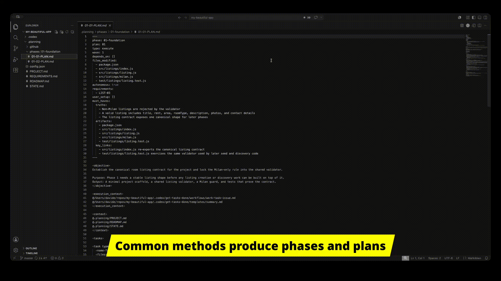
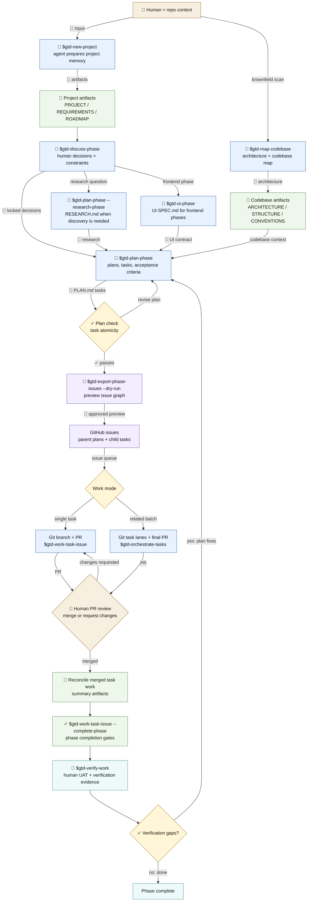

<p align="center">
  </br>
  <i>Get Tasks Done turns AI coding agents into reviewable GitHub task workers while keeping the useful parts of spec-driven development.</i>
</p>

<p align="center">
  
</p>

Most AI coding workflows fail the same way: you give an agent a feature and it comes back with a diff that is too large to review.

Get Tasks Done (GTD) is a workflow layer that turns product and software specs into local planning artifacts, exports implementation work to GitHub task issues, and keeps code changes small enough to review through pull requests, validation evidence and explicit human approval.

The project started from <a href="https://github.com/open-gsd/get-shit-done-redux" target="_blank">open-gsd/get-shit-done-redux</a> and has since been rebuilt around task issue execution, PR review, reconciliation and verification.

## Quick start

### Option A: Try safely with the demo app
Recommended if you are evaluating GTD.

#### ⚡ [Go to the 5-minute demo](https://github.com/ai-is-gonna/get-tasks-done-demo-app)

### Option B: Use GTD in your own repo

Use this only after you understand how GTD works.

1. Install GTD for Codex:

   ```bash
   npx @ai-is-gonna/get-tasks-done@latest --codex --global
   ```

2. In a GitHub-backed repo:

   ```text
   $gtd-new-project
   ```

3. Ask GTD to plan a first phase:

   ```text
   $gtd-spec-phase 1
   $gtd-plan-phase 1
   ```

4. Export only when the plans look right:

   ```text
   $gtd-export-phase-issues 1
   ```

5. Implement the first 2 tasks:

   ```text
   $gtd-orchestrate-tasks the first 2 tasks
   ```

## Who this is for

Use GTD if you:

- already review work through GitHub issues and pull requests
- want AI agents to work on bounded tasks instead of whole features
- care about small diffs, validation evidence, and human approval
- are trying to use Codex, Claude Code, Cursor, Gemini, OpenCode, or similar tools on real repositories

Do not use GTD if you:

- want fully unattended coding
- are building throwaway prototypes
- do not use GitHub
- prefer one-shot agent sessions over reviewable delivery

## Technical evaluation

At a system level, GTD has five moving parts:

| Part | Responsibility |
| --- | --- |
| Runtime commands | Slash-command style workflows installed into Codex, Claude Code, Gemini, OpenCode, Cursor, and other supported agents. |
| Planning artifacts | `.planning/` project memory, requirements, roadmap, phase plans, summaries, verification records, and workflow configuration. |
| GitHub task workflow | Parent plan issues, child task issues, labels, task branches, PRs, and reconciliation after human merge. |
| Agents and prompts | Specialized planning, research, execution, review, UI, security, and verification instructions. |
| SDK | Typed query and automation surface for scripts, CI checks, dashboards, and command internals. |

Local setup writes runtime command files and project planning files. Export writes GitHub issues and labels. Task execution creates branches, comments, PRs, and validation records. Batch orchestration can create temporary task worktrees and an integration branch. Use `--dry-run` and `--read-only` when you want to inspect what GTD would do before it mutates anything.

## Planning hierarchy

GTD stores work in a nested planning model, like the original get-shit-done. Now the same structure carries through local artifacts, GitHub issues, task branches, PRs, and verification.

| Level | What it corresponds to |
| --- | --- |
| Project | The repository-level context: product intent, constraints, workflow settings, codebase knowledge, and long-lived state. |
| Milestone | A coherent delivery objective inside the project. |
| Phase | A milestone step that can be planned, executed, reviewed, and verified as one unit. |
| Plan | One implementation plan inside a phase, with scope, files, acceptance criteria, and verification commands. |
| Task | The smallest execution unit. GTD exports tasks to child GitHub issues and works them through task branches and PRs. |

The task is the unit that matters most:

```text
one planned task -> one GitHub issue -> one branch -> one PR -> human review
```

For related work, GTD can orchestrate batches while still keeping task lanes, review boundaries, validation evidence, and one final human merge gate.

## How it works



## Adoption guide

Requirements:

- Node.js `22+`
- npm `10+`
- GitHub CLI (`gh`) installed and authenticated
- A GitHub repository with issues and pull requests enabled
- Permission to create issues, labels, branches, pull requests, comments, and local `.planning/` files

The installer currently supports many agents thanks to the native compatibility inherited from the original project. Codex, Claude Code and OpenCode are the most tested so far on GSD.

Use installer help as the source of truth for profiles, local installs, custom config paths, and runtime-specific flags:

```bash
npx @ai-is-gonna/get-tasks-done@latest --help
```

After installation, run `$gtd-help` in the target runtime to confirm the installed command surface. For a first repository, run `$gtd-new-project` and keep the generated `.planning/config.json` defaults until you have exercised the basic flow once.

## Install the SDK

Use the SDK when a script, CI job, or dashboard needs to read GTD state or call registered workflow handlers without driving an agent session.

```bash
npm install @ai-is-gonna/gtd-sdk
```

For example, in CI/CD, phase finalization can be compact once task PRs are merged:

```javascript
import { execFileSync as sh } from 'node:child_process';
const q = (...a) => JSON.parse(sh('node', ['./node_modules/@ai-is-gonna/gtd-sdk/dist/cli.js', 'query', ...a], { encoding: 'utf8' })).data;
const phase = process.env.GTD_PHASE ?? '1', done = q('check.completion', 'phase', phase);
if (!done.complete || done.missing_summaries.length) process.exit(0);
q('work-task-issue', '--complete-phase', phase, '--execute');
if (q('check.verification-status', phase).status !== 'pass') process.exit(1);
```

## Workflow commands

Command names below use the generic `$gtd-*` form. The installer adapts the command surface for runtimes with a different invocation style.

Most users should follow GTD's prompts instead of memorizing this table. The commands are listed so the flow is inspectable.

| Command | Outcome |
| --- | --- |
| `$gtd-map-codebase [--fast]` | Builds `.planning/codebase/` docs, including architecture, structure, conventions, testing, integrations, and concerns. |
| `$gtd-new-project` | Creates project memory, requirements, roadmap, workflow config, and initial planning state. |
| `$gtd-spec-phase <phase>` | Clarifies what a phase must deliver before implementation planning starts. |
| `$gtd-discuss-phase <phase>` | Turns unclear product or engineering intent into decisions the planner can use. |
| `$gtd-plan-phase --research-phase <phase>` | Writes or refreshes `RESEARCH.md` before the planner commits to an implementation approach. |
| `$gtd-ui-phase <phase>` | Produces `UI-SPEC.md` for frontend phases and checks the design contract before planning. |
| `$gtd-plan-phase <phase>` | Produces task-ready plans with scope, boundaries, acceptance criteria, and verification commands. |
| `$gtd-export-phase-issues <phase> --dry-run` | Previews the GitHub issue hierarchy before writing labels, issues, dependencies, or manifests. |
| `$gtd-export-phase-issues <phase>` | Writes parent plan issues, child task issues, labels, dependency links, and the local export manifest. |
| `$gtd-work-task-issue --read-only --phase <phase>` | Checks which task is workable without claiming issues, creating branches, or opening PRs. |
| `$gtd-work-task-issue [task] --phase <phase>` | Works one exported task through an isolated branch, validation, and a task PR. |
| `$gtd-orchestrate-tasks <child-issue>...` | Coordinates a small related batch through task lanes and one final comprehensive PR. |
| `$gtd-code-review <phase>` | Reviews phase changes for bugs, security issues, and code quality problems before final verification. |
| `$gtd-work-task-issue --complete-phase <phase> --execute` | Runs phase completion after merged task PRs have been reconciled into summary artifacts. |
| `$gtd-verify-work <phase>` | Runs conversational UAT, records verification evidence, and routes gaps back into planning. |
| `$gtd-progress` | Shows project status and the next recommended command. |
| `$gtd-config` | Views or updates project workflow configuration. |
| `$gtd-update` | Updates installed GTD runtime files. |
| `$gtd-help` | Shows the installed command surface for the current runtime. |

## Why it works

GTD keeps the parts of get-shit-done that are worth keeping: spec ingestion, context management, delivery without ceremony, and an SDK-backed command surface. Those pieces matter because models need structured context before they can do useful work.

The important change is the execution boundary: GTD breaks planned work into smaller tasks, checks those tasks before execution, and sends each one through GitHub issues, branches, PRs, and validation evidence. That gives reviewers something concrete to inspect, retry, or reject.

The review gates are intentional. Scope, task boundaries, checkpoint issues, PR review, merge approval, and final UAT stay with people because that is where mistakes get expensive.

## Documentation

- [Documentation index](docs/README.md)
- [Task issue operator guide](docs/task-issue-operator-guide.md)
- [Command reference](docs/COMMANDS.md)
- [Configuration](docs/CONFIGURATION.md)
- [Architecture](docs/ARCHITECTURE.md)
- [Contributor standards](docs/contributor-standards.md)
- [SDK README](sdk/README.md)

## Maturity of this project

GTD is usable today. I have tested it on a few personal projects, but it is still an early public project. The core workflow is covered by automated tests and shaped around real development work. The surface area is large, though, and some runtime integrations need more time in different teams and codebases.

Before adopting it broadly, evaluate these points in your own environment:

- Whether task-sized PRs match the way your team reviews code.
- Whether GitHub issue and label writes are acceptable for agent-assisted planning.
- Whether `.planning/` artifacts should be committed, ignored, or reviewed as delivery evidence.
- Whether your preferred runtime integration is mature enough for your team.
- Whether your CI can reuse SDK checks for phase readiness, completion, and verification status.

Contributions, issue reports, and thoughtful feedback are welcome and appreciated!
